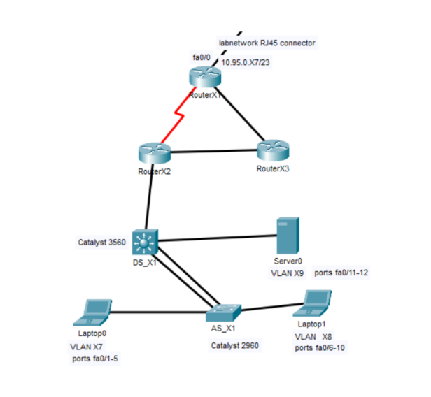

# Small Business Network Design & Configuration

## Overview
Designed and configured a small business network using Cisco IOS. The network includes multiple routers and Layer 2/3 switches with VLAN segmentation, dynamic routing and security features.

## Network Topology


## Key Features
- OSPF dynamic routing across multiple routers 
- VLAN segmentation and inter-VLAN routing (Layer 3 switch)
- Implemented DHCP server on Layer 3 switch for dynamic IP address allocation with excluded address ranges for static assignments
- EtherChannel link aggregation between DS_X1 and AS_X1 
- Spanning Tree (PVST) for redundancy  
- Network security: DHCP Snooping, DAI, BPDU Guard
- Configured port security with sticky MAC learning and limited devices per access port
- Implemented network-wide time synchronization using external NTP servers.
- Secure remote access using SSH  

## My Contributions
- Designed IP addressing scheme with subnetting to support required number of devices in each VLAN  
- Configured routing (OSPF) and switching features  
- Implemented VLANs and inter-VLAN routing
- Configured DHCP server and its pools for the subnets with excluded addresses for static ip addressing. 
- Applied network security configurations   
- Tested connectivity and redundancy across the network  

## Technologies
- Cisco IOS  
- Routing & Switching: OSPF, STP/PVST, EtherChannel  
- Security: DHCP Snooping, DAI, BPDU Guard, Port Security, SSH  
- VLANs & Layer 2/3 switching   

## Network Structure
The topology consists of:
- 3 routers, of which two are connected also via serial link.  
- Layer 2 and Layer 3 switches  
- Multiple VLANs for network segmentation  
- Redundant links for high availability  

## Configuration Examples

### OSPF Configuration
```bash
router ospf 1
 router-id 1.1.1.1
 network 10.95.98.0 0.0.255.255 area 0

##Example Access Port configuration:
interface range fa0/1 - 5
 switchport mode access
 switchport access vlan 97

interface range fa0/6 - 10
 switchport mode access
 switchport access vlan 98

interface range fa0/11 - 12
 switchport mode access
 switchport access vlan 99

! Disable unused ports
interface range fa0/13 - 24
shutdown
  
##Example Etherchannel configuration:
interface range f1/0/23 - 24
 shutdown
 channel-group 1 mode desirable
 no shutdown

interface port-channel 1
 switchport mode trunk
 switchport trunk allowed vlan 97,98,99

##Example DHCP server configuration:
ip dhcp excluded-address 10.95.98.1 10.95.98.5

ip dhcp pool Students
 network 10.95.98.0 255.255.255.192
 default-router 10.95.98.1
 dns-server 8.8.8.8

##Example Portsecurity implementation:
interface range fa0/1 - 12
 switchport port-security
 switchport port-security maximum 2
 switchport port-security violation shutdown
 switchport port-security mac-address sticky


